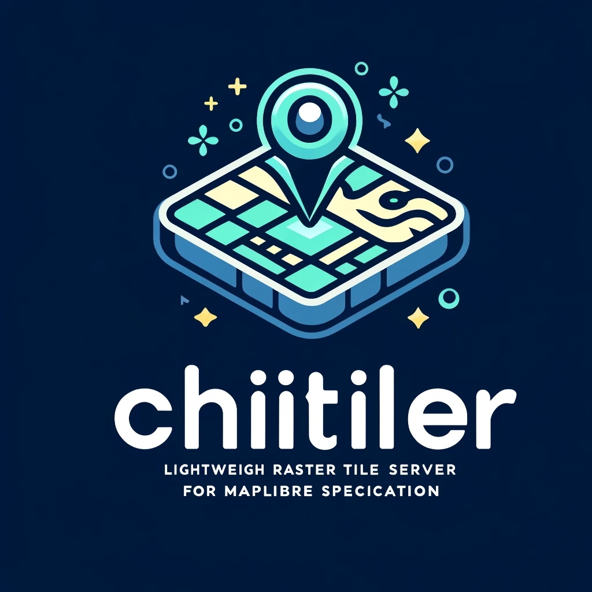
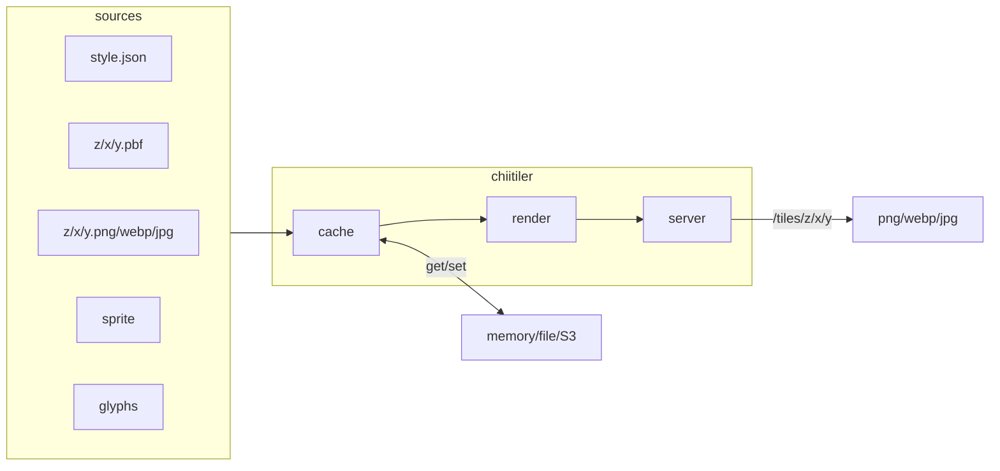

# chiitiler - The Tiny MapLibre Server


[](https://codecov.io/gh/Kanahiro/chiitiler)

*generated by DALL-E*

chii-tiler: "tiny" in Japanese is "chiisai", shorten into "chii"

## motivation

- In this type of server, there is a de-facto - [maptiler/tileserver-gl](https://github.com/maptiler/tileserver-gl), but this is too big for me.
- I want a server accept style.json-url and respond raster tile, inspired by [developmentseed/titiler](https://github.com/developmentseed/titiler)

## features

### /tiles

chiitiler provides you with `/tiles` raster-tile endpoint. Once server launched, you can use like this:

```planetext
http://localhost:3000/tiles/0/0/0.png?url=https://tile.openstreetmap.jp/styles/osm-bright/style.json
http://localhost:3000/tiles/0/0/0.webp?margin=100&url=https://tile.openstreetmap.jp/styles/maptiler-toner-en/style.json
http://localhost:3000/tiles/1/1/1.jpg?tileSize=256&quality=80&url=https://tile.openstreetmap.jp/styles/osm-bright/style.json
```

### /clip.png|webp|jpg|jpeg

chiitiler provides you with `/clip.png|webp|jpg|jpeg` endpoint. Once server launched, you can use like this:

```planetext
# default size is 1024, this is longer axis and shorter axis is calculated by aspect ratio
http://localhost:3000/clip.png?bbox=100,30,150,60&url=https://path/to/style.json
# specify size
http://localhost:3000/clip.png?bbox=100,30,150,6&size=512&url=https://path/to/style.json
# specify quality
http://localhost:3000/clip.png?bbox=100,30,150,6&size=512&quality=80&url=https://path/to/style.json
```

#### POST endpoint

Each endpoint also supports POST method. You can pass style.json as a body. (then, url parameter is not needed)

## architecture



## usage

### Container Image

```sh
docker pull ghcr.io/kanahiro/chiitiler
docker run -p 3000:3000 ghcr.io/kanahiro/chiitiler # -> tile-server

# recommended: you can use environment variables
docker run -p 3000:3000 -d \
-e CHIITILER_CACHE_METHOD=s3 \
-e CHIITILER_S3CACHE_BUCKET=bucketname \
-e CHIITILER_S3_REGION=ap-northeast-1 \
ghcr.io/kanahiro/chiitiler

# you also can pass options
docker run -p 8000:8000 ghcr.io/kanahiro/chiitiler tile-server -p 8000 -c s3 -s3b bucketname -s3r ap-northeast-1
```

#### Environment Variables

you can pass server options via environment variables

| env var                            | default  | description                                    |
| ---------------------------------- | -------- | ---------------------------------------------- |
| CHIITILER_PORT                     | 3000     | port number                                    |
| CHIITILER_PROCESSES                | 1        | num of chiitiler processes. 0 means all-CPUs   |
| CHIITILER_DEBUG                    | false    | debug mode                                     |
| CHIITILER_CACHE_METHOD             | none     | cache method, `none`, `memory`, `file` or `s3` |
| CHIITILER_CACHE_TTL_SEC            | 3600     | cache ttl, effect to `memory` and `file`       |
| CHIITILER_MEMORYCACHE_MAXITEMCOUNT | 1000     | max items for memorycache                      |
| CHIITILER_FILECACHE_DIR            | .cache   | filecache directory                            |
| CHIITILER_S3CACHE_BUCKET           |          | s3cache bucket name                            |
| CHIITILER_S3_REGION                | us-east1 | s3 bucket region for caching/fetching          |
| CHIITILER_S3_ENDPOINT              |          | s3 endpoint for caching/fetching               |

### Local

- Node.js v18 or v20

```sh
npm install
npm run build
node dist/main.js tile-server
# running server: http://localhost:3000

# develop
npm run dev
# running server: http://localhost:3000
# debug page: http://localhost:3000/debug
```

#### options

```sh
node dist/main.js tile-server -p 8000 -c file -ctl 60 -fcd cachedir -D
# -p: port number
# -c: cache method
# -ctl: cache ttl
# -fcd: cache directory
# -D: debug mode

node dist/main.js tile-server -c memory -ctl 60 -mci 1000
# -mci: max cache items

node dist/main.js tile-server -c s3 -s3b chiitiler -s3r ap-northeast-1
# -s3b: S3 bucket name for cache
# -s3r: S3 bucket region
# caution: TTL is not supported in S3 cache, please utilize S3 lifecycle policy
```

#### debug page

- in debug mode, you can access debug page: <http://localhost:3000/debug>
- You can pass style.json url:
  - <http://localhost:3000/debug?url=https://tile.openstreetmap.jp/styles/osm-bright/style.json>

## supported protocols in style.json

- `http://` or `https://` protocol are used in Style Specification
- In addition, chiitiler supports following protocols:
  - `s3://` for S3 bucket
  - `file://` for local file
  - `mbtiles://` for local MBTIles files
  - `pmtiles://` form PMTiles, remote or local or s3
- Only when `http://` and `https://` chiitiler will cache them with a specified method.

### example

[./localdata/style.json](./localdata/style.json)

```json
{
  "version": "8",
  "sources": {
    "dir": {
      "type": "vector",
      "tiles": [
        "file://localdata/tiles/{z}/{x}/{y}.pbf"
      ],
      "maxzoom": 6
    },
    "mbtiles": {
      "type": "vector",
      "tiles": [
        "mbtiles://localdata/school.mbtiles/{z}/{x}/{y}"
      ],
      "maxzoom": 10
    },
    "pmtiles": {
      "type": "vector",
      "tiles": [
        "pmtiles://localdata/school.pmtiles/{z}/{x}/{y}"
      ],
      "maxzoom": 10
    },
    "s3": {
      "type": "vector",
      "tiles": [
        "s3://tiles/{z}/{x}/{y}.pbf"
      ],
      "maxzoom": 6
    }
  },
  "layers": [
    {
      "id": "dir",
      "source": "dir",
      "source-layer": "P2921",
      "type": "circle",
      "paint": {
        "circle-radius": 10,
        "circle-color": "red"
      }
    },
    {
      "id": "mbtiles",
      "source": "mbtiles",
      "source-layer": "P2921",
      "type": "circle",
      "paint": {
        "circle-radius": 7,
        "circle-color": "blue"
      }
    },
    {
      "id": "pmtiles",
      "source": "pmtiles",
      "source-layer": "P2921",
      "type": "circle",
      "paint": {
        "circle-radius": 5,
        "circle-color": "yellow"
      }
    },
    {
      "id": "s3",
      "source": "s3",
      "source-layer": "P2921",
      "type": "circle",
      "paint": {
        "circle-radius": 3,
        "circle-color": "green"
      }
    }
  ]
}
```

## development

- run `docker compose up`
