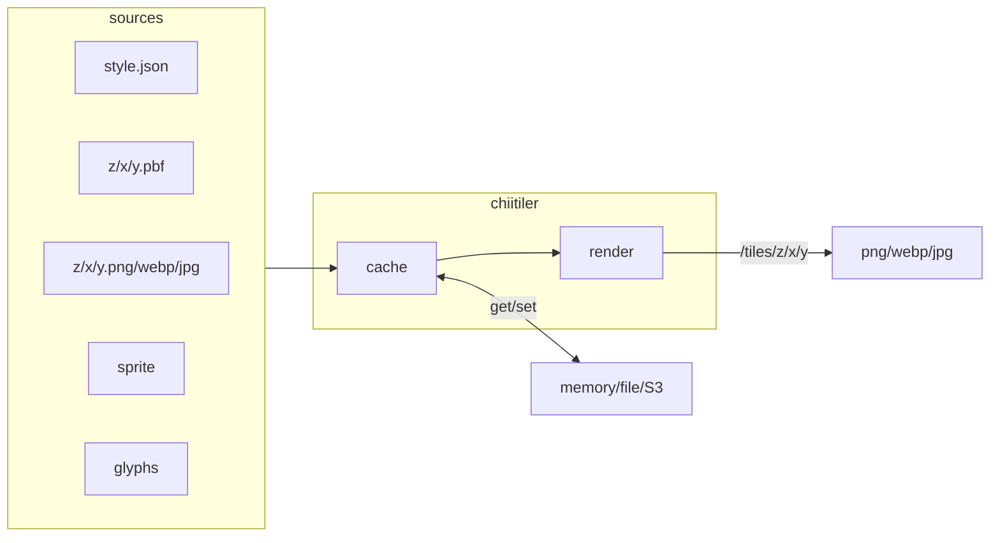

# chiitiler - Tiny VectorTile rendering server

chii-tiler

"tiny" in Japanese is "chiisai", shorten this into "chii"

## motivation

-   In this type of server, there is a de-facto - [maptiler/tileserver-gl](https://github.com/maptiler/tileserver-gl), but this is too big for me.
-   I want a server accept style.json-url and respond raster tile, inspired by [developmentseed/titiler](https://github.com/developmentseed/titiler)

chiitiler provides you with `/tiles` raster-tile endpoint. Once server launched, you can use like this:

```planetext
http://localhost:3000/tiles/0/0/0.png?url=https://tile.openstreetmap.jp/styles/osm-bright/style.json
http://localhost:3000/tiles/0/0/0.webp?url=https://tile.openstreetmap.jp/styles/maptiler-toner-en/style.json
http://localhost:3000/tiles/1/1/1.jpg?tileSize=256&url=https://tile.openstreetmap.jp/styles/osm-bright/style.json
```

## architecture



## usage

### Local

-   Node.js v18 or v20

```sh
npm install
npm run build
node dist/main.js tile-server
# running server: http://localhost:3000

# develop
npm run dev
# running server: http://localhost:3000
# debug page: http://localhost:3000/debug
```

#### options

```sh
node dist/main.js tile-server -p 8000 -c file -ctl 60 -fcd cachedir -D
# -p: port number
# -c: cache method
# -ctl: cache ttl
# -fcd: cache directory
# -D: debug mode

node dist/main.js tile-server -c memory -ctl 60 -mci 1000
# -mci: max cache items

node dist/main.js tile-server -c s3 -s3b chiitiler -s3r ap-northeast-1
# -s3b: S3 bucket name for cache
# -s3r: S3 bucket region
# caution: TTL is not supported in S3 cache, please utilize S3 lifecycle policy
```

#### debug page

-   in debug mode, you can access debug page: http://localhost:3000/debug
-   You can pass style.json url:
    -   http://localhost:3000/debug?url=https://tile.openstreetmap.jp/styles/osm-bright/style.json

### Container Image

```sh
docker pull ghcr.io/kanahiro/chiitiler
docker run -p 3000:3000 ghcr.io/kanahiro/chiitiler # -> chiitiler tile-server
docker run -p 8000:8000 ghcr.io/kanahiro/chiitiler tile-server -p 8000 -c s3 -s3b bucketname -s3r ap-northeast-1
# http://localhost:3000/debug
# http://localhost:3000/debug?url=s3://tiles/style.json
```

#### Environment Variables

you can pass server options via environment variables

| env var                                  | default  | description                                    |
| ---------------------------------------- | -------- | ---------------------------------------------- |
| CHIITILER_PORT                           | 3000     | port number                                    |
| CHIITILER_DEBUG                          | false    | debug mode                                     |
| CHIITILER_CACHE_METHOD                   | none     | cache method, `none`, `memory`, `file` or `s3` |
| CHIITILER_CACHE_TTL_SEC                  | 3600     | cache ttl, effect to `memory` and `file`       |
| CHIITILER_CACHE_MEMORYCACHE_MAXITEMCOUNT | 1000     | max items for memorycache                      |
| CHIITILER_CACHE_FILECACHE_DIR            | .cache   | filecache directory                            |
| CHIITILER_CACHE_S3CACHE_BUCKET           |          | s3cache bucket name                            |
| CHIITILER_S3_REGION                      | us-east1 | s3 bucket region for get/put                   |

## development

-   to develop, all you need is run `docker compose up`
