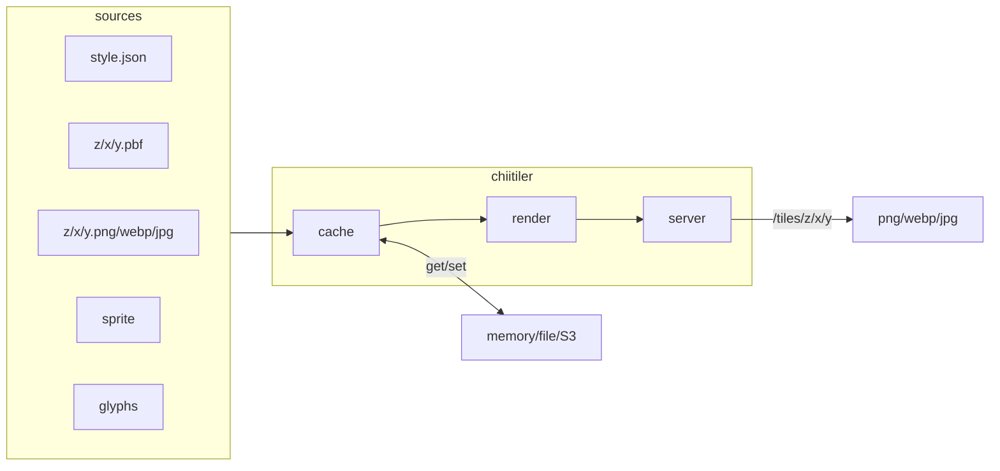

# chiitiler - The Tiny MapLibre Server


[](https://codecov.io/gh/Kanahiro/chiitiler)

*generated by DALL-E*

chii-tiler: "tiny" in Japanese is "chiisai", shorten into "chii"

## motivation

- In this type of server, there is a de-facto - [maptiler/tileserver-gl](https://github.com/maptiler/tileserver-gl), but this is too big for me.
- I want a server accept style.json-url and respond raster tile, inspired by [developmentseed/titiler](https://github.com/developmentseed/titiler)

## usecases

- [MIERUNE/tiles](https://github.com/MIERUNE/tiles) - You can find example [here](https://mierune.github.io/tiles/color.html#11.62/43.064/141.3375)
- [dayjournal/qgis-amazonlocationservice-plugin](https://github.com/dayjournal/qgis-amazonlocationservice-plugin) - used in Maps feature
- [Allmaps Latest - Bluesky](https://bsky.app/profile/latest.allmaps.org)

## features

### /tiles

chiitiler provides you with an endpoint `/tiles`. Once server launched, you can use the endpoint like this:

```planetext
http://localhost:3000/tiles/0/0/0.png?url=https://tile.openstreetmap.jp/styles/osm-bright/style.json
http://localhost:3000/tiles/0/0/0.webp?margin=100&url=https://tile.openstreetmap.jp/styles/maptiler-toner-en/style.json
http://localhost:3000/tiles/1/1/1.jpg?tileSize=256&quality=80&url=https://tile.openstreetmap.jp/styles/osm-bright/style.json
```

### /clip.png|webp|jpg|jpeg

chiitiler provides you with `/clip.png|webp|jpg|jpeg` endpoint. Once server launched, you can use like this:

```planetext
# default size is 1024, this is longer axis and shorter axis is calculated by aspect ratio
http://localhost:3000/clip.png?bbox=100,30,150,60&url=https://path/to/style.json
# specify size
http://localhost:3000/clip.png?bbox=100,30,150,6&size=512&url=https://path/to/style.json
# specify quality
http://localhost:3000/clip.png?bbox=100,30,150,6&size=512&quality=80&url=https://path/to/style.json
```

#### POST endpoint

Each endpoint also supports POST method. You can pass style.json as a body. (then, url parameter is not needed)

## architecture



## usage

### Container Image

```sh
docker pull ghcr.io/kanahiro/chiitiler
docker run -p 3000:3000 ghcr.io/kanahiro/chiitiler # -> tile-server

# recommended: you can use environment variables
docker run -p 3000:3000 -d \
-e CHIITILER_CACHE_METHOD=s3 \
-e CHIITILER_S3CACHE_BUCKET=bucketname \
-e CHIITILER_S3_REGION=ap-northeast-1 \
ghcr.io/kanahiro/chiitiler
```

#### Environment Variables

you can pass server options via environment variables

| env var                            | default  | description                                    |
| ---------------------------------- | -------- | ---------------------------------------------- |
| CHIITILER_PORT                     | 3000     | port number                                    |
| CHIITILER_PROCESSES                | 1        | num of chiitiler processes. 0 means all-CPUs   |
| CHIITILER_DEBUG                    | false    | debug mode                                     |
| CHIITILER_STREAM_MODE              | false    | stream mode                                    |
| CHIITILER_CACHE_METHOD             | none     | cache method, `none`, `memory`, `file`, `s3` or `gcs` |
| CHIITILER_CACHE_TTL_SEC            | 3600     | cache ttl, effect to `memory` and `file`       |
| CHIITILER_MEMORYCACHE_MAXITEMCOUNT | 1000     | max items for memorycache                      |
| CHIITILER_FILECACHE_DIR            | .cache   | filecache directory                            |
| CHIITILER_S3CACHE_BUCKET           |          | s3cache bucket name                            |
| CHIITILER_S3_REGION                | us-east1 | s3 bucket region for caching/fetching          |
| CHIITILER_S3_ENDPOINT              |          | s3 endpoint for caching/fetching               |
| CHIITILER_S3_FORCE_PATH_STYLE      | false    | force path style for s3, needed for minio      |
| CHIITILER_GCS_BUCKET               |          | gcs cache bucket name                          |
| CHIITILER_GCS_PROJECT_ID           |          | gcs project id                                 |
| CHIITILER_GCS_KEY_FILENAME         |          | gcs key filename                               |

### debug page

- in debug mode, you can access:
  - debug page: <http://localhost:3000/debug>
    - You can pass style.json url: <http://localhost:3000/debug?url=https://tile.openstreetmap.jp/styles/osm-bright/style.json>
  - editor page: <http://localhost:3000/editor>

## deployment

### AWS CDK

- you can deploy chiitiler with AWS CDK, check [cdk](./cdk)

## supported protocols in style.json

- `http://` or `https://` protocol are used in Style Specification
- In addition, chiitiler supports following protocols:
  - `s3://` for S3 bucket
  - `gs://` for Google Cloud Storage bucket
  - `file://` for file system
  - `mbtiles://` for MBTIles files
  - `pmtiles://` for PMTiles, remote or local or s3
  - `cog://` experimental, for Cloud Optimized GeoTIFF. CRS must be EPSG:3857.
- Only when `http://` and `https://` chiitiler cache them with a method you specified.

### example

[./localdata/style.json](./localdata/style.json)

```json
{
  "version": "8",
  "sources": {
    "dir": {
      "type": "vector",
      "tiles": [
        "file://localdata/tiles/{z}/{x}/{y}.pbf"
      ],
      "maxzoom": 6
    },
    "mbtiles": {
      "type": "vector",
      "tiles": [
        "mbtiles://localdata/school.mbtiles/{z}/{x}/{y}"
      ],
      "maxzoom": 10
    },
    "pmtiles": {
      "type": "vector",
      "tiles": [
        "pmtiles://localdata/school.pmtiles/{z}/{x}/{y}"
      ],
      "maxzoom": 10
    },
    "s3": {
      "type": "vector",
      "tiles": [
        "s3://tiles/{z}/{x}/{y}.pbf"
      ],
      "maxzoom": 6
    },
    "gcs": {
      "type": "vector",
      "tiles": [
        "gs://tiles/{z}/{x}/{y}.pbf"
      ],
      "maxzoom": 6
    },
    "cog": {
      "type": "raster",
      "tiles": [
        "cog://https://sentinel-cogs.s3.us-west-2.amazonaws.com/sentinel-s2-l2a-cogs/54/T/WN/2024/9/S2A_54TWN_20240908_0_L2A/TCI.tif/{z}/{x}/{y}"
      ],
      "tileSize": 256
    }
  },
  "layers": [
    {
      "id": "dir",
      "source": "dir",
      "source-layer": "P2921",
      "type": "circle",
      "paint": {
        "circle-radius": 10,
        "circle-color": "red"
      }
    },
    {
      "id": "mbtiles",
      "source": "mbtiles",
      "source-layer": "P2921",
      "type": "circle",
      "paint": {
        "circle-radius": 7,
        "circle-color": "blue"
      }
    },
    {
      "id": "pmtiles",
      "source": "pmtiles",
      "source-layer": "P2921",
      "type": "circle",
      "paint": {
        "circle-radius": 5,
        "circle-color": "yellow"
      }
    },
    {
      "id": "s3",
      "source": "s3",
      "source-layer": "P2921",
      "type": "circle",
      "paint": {
        "circle-radius": 3,
        "circle-color": "green"
      }
    },
    {
      "id": "pmtiles-s3",
      "source": "pmtiles-s3",
      "source-layer": "P2921",
      "type": "circle",
      "paint": {
        "circle-radius": 3,
        "circle-color": "purple"
      }
    },
    {
      "id": "gcs",
      "source": "gcs",
      "source-layer": "P2921",
      "type": "circle",
      "paint": {
        "circle-radius": 3,
        "circle-color": "purple"
      }
    },
    {
      "id": "cog",
      "source": "cog",
      "type": "raster",
      "paint": {
        "raster-opacity": 0.5
      }
    }
  ]
}
```

## Library Mode

- chiitiler can be used as a library to render MapLibre Style.
- methods to render MapLibre Style are exposed from `chiitiler` package.

### installation

```sh
npm install chiitiler
```

- chiitiler requires some dependencies in runtime, you can find them in [Dockerfile](./Dockerfile)

### Usage

```typescript
import {
    getRenderedBboxBuffer,
    getRenderedTileBuffer,
    ChiitilerCache
} from 'chiitiler';

const s3Cache = ChiitilerCache.s3Cache({
    bucket: 'chiitiler',
    region: 'ap-northeast-1',
    endpoint: null,
});
// credentials are loaded from environment variables: AWS_ACCESS_KEY_ID, AWS_SECRET_ACCESS_KEY

const gcsCache = ChiitilerCache.gcsCache({
    bucket: 'chiitiler',
    projectId: 'your-project-id',
    keyFilename: '/path/to/key.json',
});
// credentials are loaded from environment variables: GOOGLE_APPLICATION_CREDENTIALS

const tileBuf = await getRenderedTileBuffer({
    stylejson: 'https://example.com/style.json', // or StyleSpecification object
    z: 0,
    x: 0,
    y: 0,
    tileSize: 512,
    ext: 'webp', // png, webp, jpg
    cache: s3Cache,
    quality: 80,
    margin: 0,
});

const bboxBuf = await getRenderedBboxBuffer({
    stylejson: 'file://path/to/style.json', // or StyleSpecification object
    bbox: [123.4, 34.5, 124.5, 35.6],
    size: 1024,
    cache: s3Cache,
    ext: 'webp',
    quality: 80,
});

// return value is Buffer - binary of each image
```

## development

- run `docker compose up`
