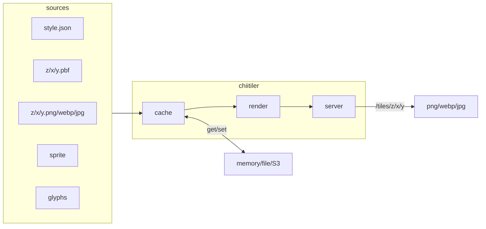

# chiitiler – Tiny MapLibre Server


[](https://codecov.io/gh/Kanahiro/chiitiler)


> Chiitiler is a tiny MapLibre server that renders raster tiles and map cut-outs from any MapLibre Style JSON, with built-in caching backends for source assets and a lightweight debug UI.

## Overview

Chiitiler accepts remote or local `style.json` definitions and serves raster tiles or bounding-box images on demand. It was inspired by [`maptiler/tileserver-gl`](https://github.com/maptiler/tileserver-gl) and [`developmentseed/titiler`](https://github.com/developmentseed/titiler) but is intentionally minimal, scriptable, and easy to self-host.

### Highlights

- Zero-config startup: point Chiitiler at a style URL or POST a style object to receive tiles.
- Optimized for ephemeral serverless runtimes such as AWS Lambda.
- Multiple cache adapters (`memory`, `file`, `s3`, `gcs`) to cache shared source assets (MVT tiles, glyphs, sprites) and reduce redundant fetches.
- Built-in `/debug` and `/editor` pages to preview styles during development.

### In Production

- [MIERUNE/tiles](https://github.com/MIERUNE/tiles) – see the live example [map](https://mierune.github.io/tiles/color.html#11.62/43.064/141.3375).
- [dayjournal/qgis-amazonlocationservice-plugin](https://github.com/dayjournal/qgis-amazonlocationservice-plugin) – powering QGIS integrations.
- [PLATEAU VIEW](https://plateauview.mlit.go.jp/) – serving Cesium.js imagery through the `/tiles` endpoint.
- [Allmaps Latest (Bluesky)](https://bsky.app/profile/latest.allmaps.org).

## Supported Data Protocols

Chiitiler can load tiles, sprites, glyphs, and assets via:

- `http://` and `https://`
- `s3://` (AWS S3 or compatible endpoints)
- `gs://` (Google Cloud Storage)
- `file://`
- `mbtiles://`
- `pmtiles://`
- `cog://` (Cloud Optimized GeoTIFF, CRS must be `EPSG:3857`)

## Project Layout

```
src/
  main.ts           # CLI entry point and cluster bootstrap
  cli.ts            # Commander-based CLI definition
  server/           # Hono HTTP server & debug UI
  render/           # Rasterization and Sharp pipelines
  cache/            # Cache adapters (none/memory/file/s3/gcs)
  source/           # Helpers for reading external sources
tests/              # Vitest integration & benchmark suites
localdata/          # Sample styles and tiles for demos
cdk/                # AWS CDK deployment project
```

## Quick Start

### Requirements

- Node.js 20.10.0 or newer (`.node-version` is provided).
- System dependencies to support `sharp` (see [Dockerfile](./Dockerfile) for reference).

### Run From Source

```bash
git clone https://github.com/Kanahiro/chiitiler.git
cd chiitiler
npm install
npx tsx src/main.ts tile-server --port 3000 --debug
```

When the server starts you can request a tile:

```
http://localhost:3000/tiles/0/0/0.png?url=https://tile.openstreetmap.jp/styles/osm-bright/style.json
```

### Docker Image

```bash
docker pull ghcr.io/kanahiro/chiitiler:latest
docker run --rm -p 3000:3000 \
  -e CHIITILER_CACHE_METHOD=memory \
  -e CHIITILER_CACHE_TTL_SEC=600 \
  ghcr.io/kanahiro/chiitiler:latest
```

The container entrypoint wraps `node /app/build/main.cjs tile-server`, so command-line options can be provided via env vars or by overriding the container CMD explicitly.

#### docker-compose (local S3 + GCS emulation)

The included [`docker-compose.yml`](./docker-compose.yml) spins up MinIO and `fake-gcs-server`:

```bash
docker compose up
```

Volumes mount `localdata/` and `.cache/` so test assets and cached source data persist between runs.

## HTTP API

| Method | Path Pattern | Description |
| ------ | ------------ | ----------- |
| GET/POST | `/tiles/{z}/{x}/{y}.{ext}` | Render a raster tile (`png`, `jpeg`, `jpg`, `webp`). |
| GET/POST | `/clip.{ext}` | Render a bounding box image (`png`, `jpeg`, `jpg`, `webp`). |
| GET/POST | `/static/{lon},{lat},{zoom}[@{bearing}][,{pitch}]/{width}x{height}.{ext}` | Render a static image (`png`, `jpeg`, `jpg`, `webp`). |
| GET | `/debug` | Style explorer UI (requires debug mode). |
| GET | `/editor` | Lightweight style editor (requires debug mode). |

### Query Parameters

- `url` – Required when using GET. Points to a MapLibre Style JSON.
- `tileSize` – Tile size in pixels (default `512`).
- `quality` – JPEG/WebP quality (default `100`).
- `margin` – Tile edge margin (default `0`).
- `bbox` – Bounding box for `/clip` as `minLon,minLat,maxLon,maxLat`.
- `size` – Longest edge of `/clip` output (default `1024`).

POST requests accept the style object directly in the JSON body (`{ "style": { ... } }`).

### Streaming Responses

Enable streaming (Sharp pipeline without buffering) by setting `CHIITILER_STREAM_MODE=true` or passing `--stream`.

## CLI Reference

Chiitiler exposes a single command: `tile-server`.

```bash
npx tsx src/main.ts tile-server --help
```

| Option | Description | Environment Fallback | Default |
| ------ | ----------- | -------------------- | ------- |
| `--cache <none/memory/file/s3/gcs>` | Select cache backend. | `CHIITILER_CACHE_METHOD` | `none` |
| `--cache-ttl <seconds>` | TTL for memory/file caches. | `CHIITILER_CACHE_TTL_SEC` | `3600` |
| `--memory-cache-max-item-count <n>` | Max items in memory cache. | `CHIITILER_MEMORYCACHE_MAXITEMCOUNT` | `1000` |
| `--file-cache-dir <dir>` | Disk cache directory. | `CHIITILER_FILECACHE_DIR` | `./.cache` |
| `--s3-cache-bucket <name>` | S3 bucket for caching. | `CHIITILER_S3CACHE_BUCKET` | `""` |
| `--s3-region <region>` | S3 region used for requests. | `CHIITILER_S3_REGION` | `us-east1` |
| `--s3-endpoint <url>` | S3-compatible endpoint. | `CHIITILER_S3_ENDPOINT` | `""` |
| `--s3-force-path-style` | Force path-style requests. | `CHIITILER_S3_FORCE_PATH_STYLE` (`true/false`) | `false` |
| `--gcs-cache-bucket <name>` | GCS bucket for caching. | `CHIITILER_GCS_CACHE_BUCKET` | `""` |
| `--gcs-project-id <id>` | GCP project ID. | `CHIITILER_GCS_PROJECT_ID` | `""` |
| `--gcs-key-filename <path>` | Service account JSON. | `CHIITILER_GCS_KEY_FILENAME` | `""` |
| `--gcs-cache-prefix <prefix>` | GCS object prefix. | `CHIITILER_GCS_CACHE_PREFIX` | `""` |
| `--gcs-api-endpoint <url>` | Custom GCS endpoint. | `CHIITILER_GCS_API_ENDPOINT` | `""` |
| `--port <number>` | HTTP listen port. | `CHIITILER_PORT` | `3000` |
| `--stream` | Enable streaming mode. | `CHIITILER_STREAM_MODE` | `false` |
| `--debug` | Enable debug UI routes. | `CHIITILER_DEBUG` | `false` |

Set `CHIITILER_PROCESSES` to control clustering (`0` uses all CPUs). When `>1`, the primary process forks workers that all share the same cache adapter.

## Environment Variables

In addition to the CLI options above, the server respects:

| Variable | Default | Notes |
| -------- | ------- | ----- |
| `CHIITILER_PROCESSES` | `1` | Number of worker processes; `0` = `availableParallelism()`. |
| `AWS_ACCESS_KEY_ID` / `AWS_SECRET_ACCESS_KEY` | – | Used by the S3 cache adapter. |
| `AWS_REGION` | – | Overrides SDK default region if set. |
| `GOOGLE_APPLICATION_CREDENTIALS` | – | Path to a service account JSON used by the GCS adapter. |

## Cache Backends

Chiitiler caches the source material required for rendering (vector tiles, glyphs, sprites, spritesheets), not the final raster outputs. These cached assets are reused across requests to avoid refetching upstream sources.

- **none** – No caching; every request renders from scratch.
- **memory** – In-memory LRU cache with configurable TTL and max entries.
- **file** – Stores fetched source assets under `CHIITILER_FILECACHE_DIR`.
- **s3** – Uploads cached source assets to S3/MinIO; honors custom endpoint and path-style.
- **gcs** – Uploads cached source assets to Google Cloud Storage or `fake-gcs-server`.

Each adapter exposes the same `get`/`set` interface and can be reused when embedding Chiitiler as a library.

## Debug Tools

Run with `--debug` or `CHIITILER_DEBUG=true` to unlock:

- `/debug` – Inspect styles, test queries, and view response metadata.
- `/editor` – Lightweight MapLibre style editor with live preview.

## Development & Testing

```bash
npm run dev               # Watch mode via tsx
npm run build             # Bundle to build/main.cjs with esbuild
npm run test:unit         # Vitest unit suite (src/**/*.test.ts)
npm run test:integration  # End-to-end scenarios in tests/
npm run test:coverage     # Unit coverage with V8 provider
npm run test:benchmark    # Performance tests (see BENCHMARK.md)
```

Benchmark scenarios and recent measurements live in [BENCHMARK.md](./BENCHMARK.md).

## Library Usage

Chiitiler is also published as an npm library. Core helpers return Sharp instances or encoded buffers so you can integrate the renderer into other pipelines.

```ts
import { createWriteStream } from 'node:fs';
import {
    getRenderedTileBuffer,
    getRenderedBboxBuffer,
    getRenderedImageBuffer,
    getRenderedTileStream,
    getRenderedBboxStream,
    getRenderedImageStream,
    ChiitilerCache,
} from 'chiitiler';

const cache = ChiitilerCache.fileCache({ dir: './.cache', ttl: 3600 });

const tile = await getRenderedTileBuffer({
    stylejson: 'https://tile.openstreetmap.jp/styles/osm-bright/style.json',
    z: 5,
    x: 27,
    y: 12,
    tileSize: 512,
    margin: 0,
    ext: 'webp',
    quality: 100,
    cache,
});

const clip = await getRenderedBboxBuffer({
    stylejson: 'file://localdata/style.json',
    bbox: [123.4, 34.5, 124.5, 35.6],
    size: 1024,
    ext: 'png',
    quality: 95,
    cache: ChiitilerCache.noneCache(),
});

const image = await getRenderedImageBuffer({
    stylejson: 'file://localdata/style.json',
    lat: 123.45,
    lon: 67.89,
    zoom: 10,
    bearing: 180,
    pitch: 60,
    size: 1024,
    ext: 'png',
    quality: 95,
    cache,
});

// you can get Sharp streams directly
const tileStream = await getRenderedTileStream({
    stylejson: 'https://tile.openstreetmap.jp/styles/osm-bright/style.json',
    z: 5,
    x: 27,
    y: 12,
    tileSize: 512,
    margin: 0,
    ext: 'png',
    quality: 90,
    cache,
});

const bboxStream = await getRenderedBboxStream({
    stylejson: 'file://localdata/style.json',
    bbox: [123.4, 34.5, 124.5, 35.6],
    size: 1024,
    ext: 'jpeg',
    quality: 85,
    cache,
});

const imageStream = await getRenderedImageStream({
    stylejson: 'file://localdata/style.json',
    lat: 123.4,
    lon: 34.5,
    zoom: 10,
    bearing: 180,
    pitch: 60,
    size: 1024,
    ext: 'png',
    quality: 95,
    cache,
})
```

## Deployment

- **AWS CDK** – The [`cdk/`](./cdk) directory contains an AWS CDK app for provisioning Chiitiler on ECS/Fargate. See `cdk/README.md` for stack details.
- **Docker** – The provided `Dockerfile` installs runtime dependencies for `sharp` and exposes `tile-server` as the default entrypoint.
- **Bench setups** – `docker-compose.yml` provisions MinIO, Fake GCS, and sample data for local smoke tests.

## Architecture


