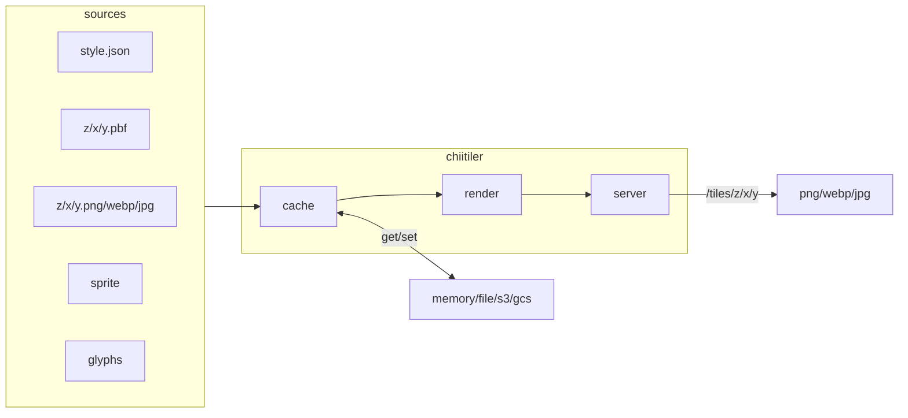

<div align="center">


# chiitiler

**A tiny raster tile server for MapLibre styles.**

Point it at any `style.json` and get back PNG / WebP / JPEG tiles, static images, or map cut-outs.

[](https://github.com/Kanahiro/chiitiler/pkgs/container/chiitiler)
[](https://github.com/Kanahiro/chiitiler/actions)
[](https://github.com/Kanahiro/chiitiler/actions)
[](https://codecov.io/gh/Kanahiro/chiitiler)
[](./LICENSE)

[Quickstart](#quickstart) · [HTTP API](#http-api) · [Library](#library-usage) · [Deployment](#deployment)

</div>

---

## From zero to a rendered tile in 30 seconds

**1. Run the server** — one command, no config file, no database, no API key.

```bash
docker run --rm -p 3000:3000 ghcr.io/kanahiro/chiitiler:latest
```

**2. Open a tile in your browser** — pass any MapLibre style URL as `?url=`.

```
http://localhost:3000/tiles/0/0/0.png?url=https://tile.openstreetmap.jp/styles/osm-bright/style.json
```

You're done. That same endpoint works as an XYZ tile source for Leaflet, MapLibre, OpenLayers, QGIS, Cesium, or anywhere else that speaks `{z}/{x}/{y}`.

> **No Docker?** `npx tsx` works too:
> ```bash
> git clone https://github.com/Kanahiro/chiitiler && cd chiitiler && npm i
> npx tsx src/main.ts tile-server --debug
> ```
> Then visit `http://localhost:3000/debug` to preview styles interactively.

## Features

- **Zero-config** — no config file, no YAML, no database. Just a style URL.
- **Works with any MapLibre style** — remote URL or `POST` the JSON inline
- **Multiple outputs** — slippy tiles (`/tiles`), bounding-box clips (`/clip`), free-form camera shots (`/camera`)
- **Serverless-friendly** — small footprint, runs on AWS Lambda via Web Adapter (see [`cdk/`](./cdk))
- **Pluggable caching** — `memory` · `file` · `s3` · `gcs` backends for shared source assets
- **Many protocols** — `http(s)` · `s3` · `gs` · `file` · `mbtiles` · `pmtiles` · `cog`
- **Library or server** — import the renderer directly into your Node.js pipeline
- **Built-in debug UI** — `/debug` and `/editor` for live style preview

## In Production

- **[MIERUNE/tiles](https://github.com/MIERUNE/tiles)** — [live example](https://mierune.github.io/tiles/color.html#11.62/43.064/141.3375)
- **[PLATEAU VIEW](https://plateauview.mlit.go.jp/)** — Cesium.js imagery via `/tiles`
- **[qgis-amazonlocationservice-plugin](https://github.com/dayjournal/qgis-amazonlocationservice-plugin)** — QGIS integration
- **[Allmaps Latest](https://bsky.app/profile/latest.allmaps.org)** — Bluesky bot

## HTTP API

| Method | Endpoint | Description |
| --- | --- | --- |
| `GET` / `POST` | `/tiles/{z}/{x}/{y}.{ext}` | Slippy-map raster tile |
| `GET` / `POST` | `/clip.{ext}` | Bounding-box cut-out |
| `GET` / `POST` | `/camera/{zoom}/{lat}/{lon}/{bearing}/{pitch}/{width}x{height}.{ext}` | Free-form camera shot |
| `GET` | `/debug`, `/editor` | Debug UI (requires `--debug`) |

`ext` is one of `png`, `jpeg`, `jpg`, `webp`.

**Query parameters**

| Name | Default | Notes |
| --- | --- | --- |
| `url` | — | Style JSON URL (required for `GET`) |
| `tileSize` | `512` | Tile size in pixels |
| `quality` | `100` | JPEG / WebP quality |
| `margin` | `0` | Tile edge margin |
| `bbox` | — | `/clip` bounding box: `minLon,minLat,maxLon,maxLat` |
| `size` | `1024` | `/clip` longest edge in pixels |

For `POST`, send the style object as JSON body: `{ "style": { ... } }`.

## Library Usage

Chiitiler is also published to npm. Returns `Buffer` or `Sharp` streams.

```ts
import { getRenderedTileBuffer, ChiitilerCache } from 'chiitiler';

const cache = ChiitilerCache.fileCache({ dir: './.cache', ttl: 3600 });

const png = await getRenderedTileBuffer({
    stylejson: 'https://tile.openstreetmap.jp/styles/osm-bright/style.json',
    z: 5, x: 27, y: 12,
    tileSize: 512,
    ext: 'png',
    quality: 100,
    margin: 0,
    cache,
});
```

Available renderers: `getRenderedTileBuffer`, `getRenderedClipBuffer`, `getRenderedCameraBuffer`, and their `*Stream` variants (`Sharp` instances for further piping).

## Configuration

All options can be set via CLI flag or environment variable.

### Server

| Flag | Env | Default |
| --- | --- | --- |
| `--port <n>` | `CHIITILER_PORT` | `3000` |
| `--debug` | `CHIITILER_DEBUG` | `false` |
| — | `CHIITILER_PROCESSES` | `1` (set `0` for all CPUs) |

### Cache

| Flag | Env | Default |
| --- | --- | --- |
| `--cache <none\|memory\|file\|s3\|gcs>` | `CHIITILER_CACHE_METHOD` | `none` |
| `--cache-ttl <seconds>` | `CHIITILER_CACHE_TTL_SEC` | `3600` |
| `--memory-cache-max-item-count <n>` | `CHIITILER_MEMORYCACHE_MAXITEMCOUNT` | `1000` |
| `--file-cache-dir <dir>` | `CHIITILER_FILECACHE_DIR` | `./.cache` |
| `--s3-cache-bucket <name>` | `CHIITILER_S3CACHE_BUCKET` | — |
| `--s3-region <region>` | `CHIITILER_S3_REGION` | `us-east-1` |
| `--s3-endpoint <url>` | `CHIITILER_S3_ENDPOINT` | — |
| `--s3-force-path-style` | `CHIITILER_S3_FORCE_PATH_STYLE` | `false` |
| `--gcs-cache-bucket <name>` | `CHIITILER_GCS_CACHE_BUCKET` | — |
| `--gcs-project-id <id>` | `CHIITILER_GCS_PROJECT_ID` | — |
| `--gcs-key-filename <path>` | `CHIITILER_GCS_KEY_FILENAME` | — |
| `--gcs-cache-prefix <prefix>` | `CHIITILER_GCS_CACHE_PREFIX` | — |
| `--gcs-api-endpoint <url>` | `CHIITILER_GCS_API_ENDPOINT` | — |

Chiitiler caches *source assets* (vector tiles, glyphs, sprites) — not final rasters — so cached data is reused across requests. Standard AWS / GCP credentials (`AWS_ACCESS_KEY_ID`, `GOOGLE_APPLICATION_CREDENTIALS`, etc.) are respected.

## Deployment

- **Docker** — `ghcr.io/kanahiro/chiitiler:latest` (entrypoint: `tile-server`)
- **Docker Compose** — see [`docker-compose.yml`](./docker-compose.yml) (includes RustFS + fake-gcs-server for local testing)
- **AWS Lambda** — ready-to-deploy CDK app in [`cdk/`](./cdk)

## Develop

Requires Node.js 24.12+ and `sharp` system deps (see [Dockerfile](./Dockerfile)).

```bash
git clone https://github.com/Kanahiro/chiitiler.git
cd chiitiler
npm install
npm run dev              # tsx watch mode
npm run test:unit        # vitest
npm run test:integration # end-to-end
npm run test:benchmark   # see BENCHMARK.md
npm run build            # bundle to build/main.cjs
```

## Architecture


```mermaid
graph LR
    subgraph sources
        direction LR
        A[style.json]
        B[z/x/y.pbf]
        C[z/x/y.png/webp/jpg]
        D[sprite]
        E[glyphs]
    end

    subgraph chiitiler
        cache
        render
        server
    end

    sources --> cache --> render --> server --/tiles/z/x/y--> png/webp/jpg
    cache <--get/set--> memory/file/s3/gcs
```

## Credits

Inspired by [`maptiler/tileserver-gl`](https://github.com/maptiler/tileserver-gl) and [`developmentseed/titiler`](https://github.com/developmentseed/titiler).

## License

[MIT](./LICENSE) © Kanahiro Iguchi
