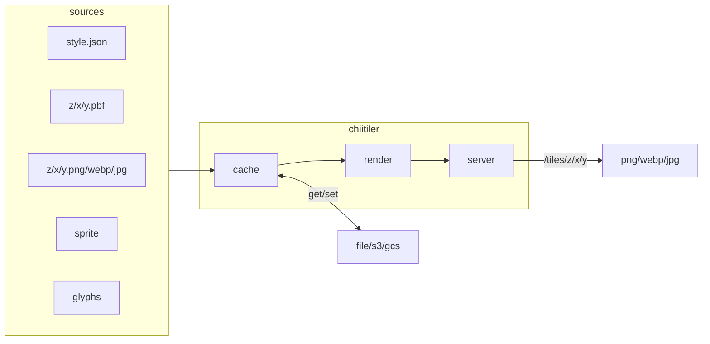

<div align="center">


# chiitiler

**A tiny raster tile server for MapLibre styles.**

Point it at any `style.json` and get back PNG / WebP / JPEG / AVIF tiles, static images, or map cut-outs.

[](https://github.com/Kanahiro/chiitiler/pkgs/container/chiitiler)
[](https://github.com/Kanahiro/chiitiler/actions)
[](https://github.com/Kanahiro/chiitiler/actions)
[](https://codecov.io/gh/Kanahiro/chiitiler)
[](./LICENSE)

[Live Demo](https://spatialty-io.github.io/chiitiler-demo/) · [Quickstart](#quickstart) · [HTTP API](#http-api) · [Library](#library-usage) · [Deployment](#deployment)

</div>

---

## From zero to a rendered tile in 30 seconds

**1. Run the server** — one command, no config file, no database, no API key.

```bash
docker run --rm -p 3000:3000 ghcr.io/kanahiro/chiitiler:latest
```

**2. Open a tile in your browser** — pass any MapLibre style URL as `?url=`.

```
http://localhost:3000/tiles/0/0/0.png?url=https://tile.openstreetmap.jp/styles/osm-bright/style.json
```

You're done. That same endpoint works as an XYZ tile source for Leaflet, MapLibre, OpenLayers, QGIS, Cesium, or anywhere else that speaks `{z}/{x}/{y}`.

> **No Docker?** Run it from source with [pnpm](https://pnpm.io):
> ```bash
> git clone https://github.com/Kanahiro/chiitiler && cd chiitiler && pnpm install
> CHIITILER_DEBUG=true pnpm tsx src/main.ts
> ```
> Then visit `http://localhost:3000/debug` to preview styles interactively.

## Features

- **Zero-config** — no config file, no YAML, no database. Just a style URL.
- **No GPU, no system libraries** — rendered by [ml2drender](https://github.com/Kanahiro/ml2drender) (`@ml2drender/node`), a pure-Rust 2D MapLibre renderer, as a Node-API addon
- **Works with any MapLibre style** — remote URL or `POST` the JSON inline
- **Multiple outputs** — slippy tiles (`/tiles`), bounding-box clips (`/clip`), free-form views (`/view`)
- **Pluggable caching** — `file` · `s3` · `gcs` backends for shared source assets, plus an in-process front cache
- **Many protocols** — `http(s)` · `s3` · `gs` · `file` · `mbtiles` · `pmtiles`
- **Library or server** — import the renderer directly into your Node.js pipeline
- **Built-in debug UI** — `/debug` and `/editor` for live style preview

## In Production

- **[MIERUNE/tiles](https://github.com/MIERUNE/tiles)** — [live example](https://mierune.github.io/tiles/color.html#11.62/43.064/141.3375)
- **[PLATEAU VIEW](https://plateauview.mlit.go.jp/)** — Cesium.js imagery via `/tiles`
- **[qgis-amazonlocationservice-plugin](https://github.com/dayjournal/qgis-amazonlocationservice-plugin)** — QGIS integration
- **[Allmaps Latest](https://bsky.app/profile/latest.allmaps.org)** — Bluesky bot
- **[Kumoy](https://www.kumoy.io/)** - used for thumbnail image of designed maps

## Presentations

- [FOSS4G Hiroshima 2026 — Presentation slides](https://drive.google.com/file/d/122JW5gJbrxnUVCVsSlcQMb22StPTnZQV/view?usp=sharing)

## HTTP API

| Method | Endpoint | Description |
| --- | --- | --- |
| `GET` / `POST` | `/tiles/{z}/{x}/{y}[@{n}x].{ext}` | Slippy-map raster tile |
| `GET` / `POST` | `/clip[@{n}x].{ext}` | Bounding-box cut-out |
| `GET` / `POST` | `/view/{zoom}/{lat}/{lon}/{bearing}/{width}x{height}[@{n}x].{ext}` | Free-form view (2D: no pitch) |
| `GET` | `/crs`, `/crs/{id}` | Ids of the registered CRSs, and a CRS's `{ projjson, tileMatrixSet }` (see Custom projections) |
| `GET` | `/debug`, `/editor` | Debug UI (requires `CHIITILER_DEBUG=true`) | — `/debug` switches between the registered CRSs

`ext` is one of `png`, `jpeg`, `jpg`, `webp`, `avif` (`avif` needs `@napi-rs/image`; without it, `500`).

**High-DPI (`@2x`)**: `@{n}x` before the extension (e.g. `/tiles/5/27/12@2x.png`) renders the same
map in `n` times the pixels: labels, lines and icons keep their size on a high-DPI screen, and the
style's sprite is read from `sprite@{n}x`. `tileSize`, `margin`, `size` and `width`/`height` stay in
CSS pixels, so a client keeps its `tileSize` (e.g. 512) and only changes the URL. A larger
`tileSize` instead shows a wider area with smaller labels.

**Query parameters**

| Name | Default | Notes |
| --- | --- | --- |
| `url` | — | Style JSON URL (required for `GET`) |
| `tileSize` | `512` | Tile size in pixels |
| `quality` | `100` | JPEG and AVIF quality (use less than `100` for AVIF: `100` is near-lossless and large). WebP is lossy below `100` (alpha stays lossless) when `@napi-rs/image` is installed, as in the Docker image, and lossless otherwise |
| `margin` | `0` | Extra pixels rendered around the tile (half on each side) and cropped, e.g. to keep labels across tile edges |
| `bbox` | — | `/clip` bounding box: `minLon,minLat,maxLon,maxLat` |
| `size` | `1024` | `/clip` longest edge in pixels |

For `POST`, send the style object as JSON body: `{ "style": { ... } }`.

**Custom projections**: register CRSs with `CHIITILER_CRS_DIR`, a directory of `<id>.json` files, and
render in one with `?crs=<id>` (`GET` and `POST`, every endpoint).

```jsonc
// $CHIITILER_CRS_DIR/utm54n.json → ?crs=utm54n
{
  "projjson": { ... },     // PROJJSON of the CRS, e.g. from `projinfo EPSG:32654 -o PROJJSON`
  "tileMatrixSet": { ... } // its tile grid: required by /tiles and /view, not by /clip
}
```

- `tileMatrixSet` is MapLibre GL JS's grid (`{ "origin": [minX, maxY], "extentAtZoom0": ... }`, as given to `addProjection`) or an [OGC 2D TileMatrixSet](https://docs.ogc.org/is/17-083r4/17-083r4.html) (2.0, JSON).
- `/tiles/{z}/{x}/{y}`: a tile of that grid (`tileSize` is its width; an OGC grid's tiles may be taller or shorter).
- `/clip`: `bbox` in CRS units, `minX,minY,maxX,maxY` (easting first, y up).
- `/view`: `lat`/`lon` in degrees, `zoom` of the grid (its first tile 512 px wide at zoom 0).
- Supported methods and limits: see [ml2drender](https://github.com/Kanahiro/ml2drender#projected-coordinate-reference-systems). An unknown id, an unsupported CRS, an invalid grid or a tile outside it answers `400`.
- A file is read when a request names it; one without a `projjson` object answers `500`.
- `POST` also takes a CRS in the body, in the same form: `{ "style": { ... }, "crs": { "projjson": { ... }, "tileMatrixSet": { ... } } }`. It takes precedence over `?crs=`.

The Docker image comes with the CRSs of [`crs/`](crs) (`CHIITILER_CRS_DIR=/app/crs`), as `?crs=EPSG-<code>`:

| | |
| --- | --- |
| World | `EPSG-4326` (WGS 84), `EPSG-8857` (Equal Earth) |
| Polar | `EPSG-3413`, `EPSG-3995` (Arctic), `EPSG-3031` (Antarctic) |
| Europe | `EPSG-3035` (LAEA Europe), `EPSG-27700` (British National Grid), `EPSG-2154` (Lambert-93), `EPSG-25832` (ETRS89 / UTM 32N), `EPSG-2056` (Swiss LV95) |
| North America | `EPSG-5070` (Conus Albers), `EPSG-3338` (Alaska Albers), `EPSG-3978` (Canada Atlas Lambert) |
| Oceania | `EPSG-3577` (Australian Albers), `EPSG-2193` (NZTM2000) |
| Asia | `EPSG-5179` (Korea Unified CS), `EPSG-3826` (TWD97 / TM2), `EPSG-6669`–`EPSG-6687` (JGD2011 / Japan Plane Rectangular CS I–XIX) |

Their PROJJSON is PROJ's, and their grid is the square from the top-left corner of the CRS's area of use,
covering it; the world CRSs' (`EPSG-4326`, `EPSG-8857`) is centered on the world instead, as MapLibre GL JS
needs the middle of the grid on the map. To show the tiles with MapLibre GL JS, register the CRS with `addProjection`: its
`tileMatrixSet` from `GET /crs/{id}`, and a converter of its `projjson` (e.g. `proj4('EPSG:4326', projjson)`),
as `/debug` does. Datum
shifts are ignored (as by the renderer). Set `CHIITILER_CRS_DIR` to your own directory to replace them.

**Rendering limits** (ml2drender renders 2D only)

- `fill-extrusion` layers are drawn as flat fills. 3D, terrain, globe, sky and light are not rendered.
- Bidirectional text and Arabic shaping are not supported, and glyphs come only from the style's `glyphs` (no local font fallback).
- JPEG has no alpha: transparent areas become black. Chroma is subsampled 4:2:0 at every quality (as sharp did by default).
- Lossy WebP (libwebp) and AVIF (rav1e at its fastest preset, 4:4:4 chroma), both via `@napi-rs/image`, take about 10 times longer to encode than lossless WebP or JPEG (25–30 ms for a 512px tile): cache the rendered tiles (e.g. behind a CDN) if you use them. AVIF is smaller than lossy WebP from mid quality on, and keeps thin colored lines sharp (WebP subsamples chroma 4:2:0).

## Library Usage

Chiitiler is also published to npm. A `Chiitiler` renders any style and returns the encoded image as
a `Uint8Array`.

```bash
npm install chiitiler @maplibre/maplibre-gl-style-spec
# only for s3:// sources (pmtiles://s3:// included) and the S3 cache
npm install @aws-sdk/client-s3
# only for gs:// sources and the GCS cache
npm install @google-cloud/storage
# only for lossy WebP (quality below 100) and AVIF
npm install @napi-rs/image
```

`@maplibre/maplibre-gl-style-spec` (for its types) is a peer dependency; the AWS and GCP SDKs and
`@napi-rs/image` are optional ones, loaded when first used. Without `@napi-rs/image`, WebP is lossless
at every quality (with a warning the first time a lower quality is asked for), and AVIF throws.

```ts
import { Chiitiler, ChiitilerCache } from 'chiitiler';

const chiitiler = new Chiitiler({
    cache: ChiitilerCache.fileCache({ dir: './.cache', ttl: 3600 }),
    // protocols: { ... },  custom URL schemes (below)
    // maxSize: 4096,       the largest image side in pixels
});

const png = await chiitiler.renderTile({
    stylejson: 'https://tile.openstreetmap.jp/styles/osm-bright/style.json',
    z: 5, x: 27, y: 12,
    tileSize: 512,
    ext: 'png',
    quality: 100,
    margin: 0,
    // pixelRatio: 2,       @2x: the same tile in twice the pixels
});
```

Methods: `renderTile` (an XYZ tile), `renderBbox` (a lon/lat box, `size` px on the long side) and
`renderView` (`center`, `zoom`, `bearing`, `width` and `height`; 2D only, no pitch).

`renderProjectedTile`, `renderProjectedBbox` and `renderProjectedView` take the same options and a
`crs` (`{ projjson, tileMatrixSet? }`, see [Custom projections](#http-api)): a tile of its grid, a box in
its units (easting first, y up; no grid needed), or a camera with the grid's zoom. An invalid CRS, grid or
tile rejects with a `RangeError`.

```ts
import { readFile } from 'node:fs/promises';

const crs = JSON.parse(await readFile('crs/EPSG-6677.json', 'utf8'));
const png = await chiitiler.renderProjectedBbox({
    stylejson: 'https://tile.openstreetmap.jp/styles/osm-bright/style.json',
    crs,
    bbox: [-20000, -60000, 20000, -30000], // meters of JGD2011 / Japan Plane Rectangular CS IX
    size: 1024,
    ext: 'png',
    quality: 100,
});
```

`stylejson` is a URL or a style object, and may differ on every call. An instance keeps renderers of
the styles it drew last, with their decoded tiles, glyphs and sprites: create one and reuse it.

### Your own cache

Any object with `get` and `set` is a cache. Keys are resource URLs, values `Uint8Array`s; return
`undefined` from `get` for a miss. It holds `http(s)://` sources (including `pmtiles://http(s)://`
tiles), e.g. in Redis to share them between processes or hosts:

```ts
import type { Cache } from 'chiitiler';

const cache: Cache = {
    get: async (url) => {
        const hit = await redis.getBuffer(url);
        return hit === null ? undefined : new Uint8Array(hit);
    },
    set: async (url, bytes) => {
        await redis.set(url, Buffer.from(bytes), 'EX', 3600);
    },
};
```

`ChiitilerCache.withFrontCache(cache)` puts the short-lived in-process layer described under
[Cache](#cache) in front of it.

### Custom protocols

`protocols` maps a scheme to a loader of its URLs, for the style URL and every source, sprite and
glyph URL in it. Custom protocols take precedence over the built-in ones, so `http` / `https` can be
replaced too (e.g. to add credentials). Return `null` when there is nothing at the URL, like HTTP 404:
a missing vector tile renders empty, a missing raster tile is replaced by its parent. Throw for other
failures: the render fails rather than returning a map with holes. Results go through the cache's
front cache, not the cache itself (cache inside the loader if needed).

```ts
import { Chiitiler, type Protocols } from 'chiitiler';

const protocols: Protocols = {
    db: async (url) => {
        // db://tiles/{z}/{x}/{y}
        const [z, x, y] = url.split('/').slice(-3).map(Number);
        return (await db.tile(z, x, y)) ?? null; // Uint8Array | null
    },
};

const chiitiler = new Chiitiler({ cache, protocols });
const png = await chiitiler.renderTile({
    stylejson: { version: 8, sources: { t: { type: 'vector', tiles: ['db://tiles/{z}/{x}/{y}'] } }, layers: [/* … */] },
    z: 5, x: 27, y: 12, tileSize: 512, ext: 'png', quality: 100, margin: 0,
});
```

Types are re-exported as well, so you can annotate call sites without depending on
`@maplibre/maplibre-gl-style-spec` resolution in your own tree:

```ts
import type {
    StyleSpecification,
    ChiitilerOptions,
    RenderTileOptions,
    RenderBboxOptions,
    RenderViewOptions,
    SupportedFormat,
    Cache,
    Protocol,
    Protocols,
} from 'chiitiler';
```

Prefer chiitiler's `StyleSpecification` over importing it from
`@maplibre/maplibre-gl-style-spec` directly: if your tree resolves a different major of
that package, the two structurally-different types are not assignable to each other.

chiitiler doesn't override the `User-Agent` on outbound HTTP requests by default, so the runtime's default is used (Node sends `node`). Some tile providers (e.g. OpenStreetMap) require an identifying User-Agent — set one with `setUserAgent('my-app/1.0')` or the `CHIITILER_USER_AGENT` environment variable.

## Configuration

The server is configured with environment variables only; it takes no command-line arguments
(not even 1.x's `tile-server` command). Empty values count as unset, and an invalid value stops
startup with an error naming the variable.

```bash
docker run --rm -p 3000:3000 -e CHIITILER_CACHE_METHOD=file -e CHIITILER_PROCESSES=0 ghcr.io/kanahiro/chiitiler:latest
```

### Server

| Variable | Default |
| --- | --- |
| `CHIITILER_PORT` | `3000` |
| `CHIITILER_DEBUG` | `false` |
| `CHIITILER_USER_AGENT` | (none) |
| `CHIITILER_PROCESSES` | `1` (set `0` for all CPUs) |
| `CHIITILER_MAX_SIZE` | `4096` |
| `CHIITILER_CACHE_CONTROL` | (none) |
| `CHIITILER_CORS` | (none) |
| `CHIITILER_CRS_DIR` | (none: Web Mercator only; `/app/crs` in the Docker image) |

`CHIITILER_PROCESSES` runs that many worker processes; `0` uses all available CPUs.
Within a process, rendering and encoding run on libuv's thread pool (up to 4 renders of a style in
parallel), so the server keeps answering (e.g. `/health`) while it draws.

`CHIITILER_MAX_SIZE` bounds every image side in pixels (tiles with their margin, `/clip` sizes, `/view`
dimensions, times `@{n}x`); larger requests answer `400`. `POST` bodies are limited to 16 MiB (`413`).

`CHIITILER_CACHE_CONTROL` sets `Cache-Control` on rendered images (e.g. `public, max-age=86400` for a CDN to
keep them; chiitiler doesn't cache rendered images itself). `GET` images carry an `ETag`, so
`If-None-Match` revalidations answer `304`. `CHIITILER_CORS` adds CORS headers for `*` or a comma-separated
list of origins.

On `SIGTERM` / `SIGINT` the server stops accepting connections and exits once the requests in
progress finish (at most 10 seconds).

### Cache

chiitiler caches the **sources** it fetches (styles, tiles, glyphs, sprites), never the rendered
images: put a CDN in front for those (`CHIITILER_CACHE_CONTROL`). There are two layers:

1. **Cache method** — where fetched bytes are kept, chosen with `CHIITILER_CACHE_METHOD`. Each
   method has its own settings (below).
2. **Front cache** — a small in-process memory cache that chiitiler puts in front of every
   method, so that repeated reads skip the disk or the network.

```
renderer needs a URL → front cache      → cache method   → fetch
                       (every source)     (http(s) only)
```

#### 1. Cache method

| `CHIITILER_CACHE_METHOD` | Keeps | Shared between processes |
| --- | --- | --- |
| `none` (default) | nothing | — |
| `file` | files in a directory | yes, on one host |
| `s3` | objects in an S3 bucket | yes |
| `gcs` | objects in a GCS bucket | yes |

`CHIITILER_CACHE_TTL_SEC` (default `3600`) is how long `file` entries live (`0`: never expire). S3 and GCS entries do not expire on their own: use a lifecycle rule.

Settings of each method:

| Method | Variable | Default |
| --- | --- | --- |
| `file` | `CHIITILER_FILECACHE_DIR` | `./.cache` |
| `s3` | `CHIITILER_S3CACHE_BUCKET` | (required) |
| | `CHIITILER_S3_REGION` | `us-east-1` |
| | `CHIITILER_S3_ENDPOINT` | (AWS) |
| | `CHIITILER_S3_FORCE_PATH_STYLE` | `false` |
| `gcs` | `CHIITILER_GCS_CACHE_BUCKET` | (required) |
| | `CHIITILER_GCS_CACHE_PREFIX` | (none) |
| | `CHIITILER_GCS_PROJECT_ID` | (from credentials) |
| | `CHIITILER_GCS_KEY_FILENAME` | (default credentials) |
| | `CHIITILER_GCS_API_ENDPOINT` | (GCS) |

The `CHIITILER_S3_*` settings also apply to `s3://` sources (`CHIITILER_GCS_*` but the bucket and
prefix to `gs://` sources). Credentials come from the standard AWS / GCP environment
(`AWS_ACCESS_KEY_ID`, `GOOGLE_APPLICATION_CREDENTIALS`, …).

A cache method keeps `http(s)://` sources only (`pmtiles://http(s)://` tiles included): local
files, `s3://`, `gs://`, `mbtiles://` and local `pmtiles://` are as close as the cache would be.

#### 2. Front cache

Whatever the method, each process also keeps what it reads in memory, for every source:

| Variable | Default |
| --- | --- |
| `CHIITILER_FRONT_CACHE_TTL_SEC` | `10` |
| `CHIITILER_FRONT_CACHE_MAX_BYTES` | `67108864` (64 MiB of payloads per process) |

Set either to `0` to turn the front cache off. Entries live for the TTL from when they were read,
even past their expiry in the cache method. With `none`, the front cache is the only cache.

#### Renderers and styles

On top of these, a renderer is kept per style (10 styles, LRU) with the tiles, glyphs and sprites
it decoded, for 5 minutes. Styles given by URL are fetched again after 60 seconds (through the
front cache only), so edits upstream show up within a minute.

#### Library

Library callers pass a cache to each call; the server's front cache is opt-in:

```ts
const cache = ChiitilerCache.withFrontCache(
    ChiitilerCache.fileCache({ dir: './.cache', ttl: 3600 }),
    { ttlSeconds: 10, maxBytes: 64 * 1024 * 1024 },
);
```

## Deployment

- **Docker** — `ghcr.io/kanahiro/chiitiler:latest` (configured with `CHIITILER_*` environment variables)
- **Docker Compose** — see [`docker-compose.yml`](./docker-compose.yml) (includes RustFS + fake-gcs-server for local testing)

> [!WARNING]
> **Do not expose chiitiler directly to the public internet.** Chiitiler fetches whatever the request tells it to: the `url` style and every source, glyph, and sprite URL inside the style (`GET` or `POST`). This allows SSRF — requests to internal networks or cloud metadata endpoints — and reads of local files (`file://`, `mbtiles://`) and buckets (`s3://`, `gs://`) with the server's credentials. Accept requests only from trusted clients, e.g. behind an authenticating proxy or a private network.

## Migrating from 1.x

2.0 renders with [ml2drender](https://github.com/Kanahiro/ml2drender) instead of MapLibre Native: no GPU, Xvfb or sharp, and about
a third of the memory. Images are close to MapLibre's but not pixel-identical (antialiasing and label
placement differ).

- **Not rendered:** 3D (`fill-extrusion` is drawn as a flat fill), terrain, globe, sky, bidirectional
  and Arabic text shaping, and glyphs the style's `glyphs` URL doesn't serve (no local font fallback).
  `/camera` is renamed `/view` and has no pitch segment:
  `/view/{zoom}/{lat}/{lon}/{bearing}/{width}x{height}.{ext}`.
- **Formats:** WebP is lossless unless `@napi-rs/image` is installed (then `quality` below 100 is
  lossy; the Docker image includes it); JPEG uses 4:2:0 chroma and
  flattens transparency over black. `.jpg` responses are `image/jpeg` (were `image/jpg`).
- **Errors:** parameters the renderer rejects (e.g. a `tileSize` that isn't a positive integer) answer
  `400` instead of `500`.
- **Server:** the `tile-server` command and its options are removed: start chiitiler without
  arguments and set the `CHIITILER_*` environment variable each flag had (see
  [Configuration](#configuration)); any argument now stops startup with an error.
  Unknown `CHIITILER_CACHE_METHOD` values and other invalid values stop startup too (1.x fell back to
  defaults). `CHIITILER_PREWARM` is removed (startup is fast without it). Images are at most 4096 px on a side unless `CHIITILER_MAX_SIZE` says otherwise.
- **Sources:** `cog://` is removed: serve COGs as raster tiles from another server (e.g. TiTiler).
- **Caches:** `file`, `s3` and `gcs` caches use new file and object names (SHA-256 of the URL; the
  old escaped names could collide) and the file cache stores raw bytes: entries written by 1.x are
  not read, and can be deleted. The `memory` method and `CHIITILER_MEMORYCACHE_MAXITEMCOUNT` are
  removed: the front cache now also sits in front of `none`, so use `none` and raise
  `CHIITILER_FRONT_CACHE_TTL_SEC` (default `10`) / `CHIITILER_FRONT_CACHE_MAX_BYTES` instead.
- **Docker:** the image has no entrypoint script; the bundle is `build/main.mjs`. The image is
  distroless (no shell): its entrypoint is `node`, so a `command` override passes only the script and
  its arguments. The AWS Lambda Web Adapter and the `cdk/` app are removed.
- **Library:**
  - `getRenderedTileBuffer`, `getRenderedClipBuffer` and `getRenderedCameraBuffer` are replaced by
    the `renderTile`, `renderBbox` and `renderView` methods of a `Chiitiler` (`renderView` takes no
    `pitch`; its options type is `RenderViewOptions`, and so on), which resolve to a `Uint8Array`.
    `cache`, `protocols` and `maxSize` are given once to `new Chiitiler(...)`, the style to every
    call. The `*Stream` variants (Sharp)
    and `prewarm()` are removed.
  - Cache values are `Uint8Array` and `name` is optional, so any `{ get, set }` object is a cache.
  - `memoryCache` is removed (use `withFrontCache(noneCache(), …)`), `withMemoryCache` is renamed
    `withFrontCache`, and `Cache.memory` is renamed `Cache.front`.
  - New `protocols` option for custom URL schemes.
  - `@maplibre/maplibre-gl-style-spec` is a peer dependency, and `@aws-sdk/client-s3`,
    `@google-cloud/storage` and `@napi-rs/image` optional ones: install them for `s3://` / `gs://`
    sources and caches, and lossy WebP and AVIF.
  - The renderer comes from `@ml2drender/node`, which has prebuilt addons for linux-x64 and
    linux-arm64 (glibc), darwin-x64, darwin-arm64 and win32-x64.

## Develop

Requires Node.js 24.22.1+ and pnpm (`corepack enable`).

```bash
git clone https://github.com/Kanahiro/chiitiler.git
cd chiitiler
pnpm install
pnpm dev              # tsx watch mode
pnpm lint             # biome lint + format check
pnpm test:unit        # vitest
pnpm test:integration # end-to-end
pnpm test:benchmark   # see bench/BENCHMARK.md
pnpm build            # bundle to build/main.mjs (loads @ml2drender/node from node_modules)
```

The renderer is [ml2drender](https://github.com/Kanahiro/ml2drender)'s Node-API addon (`@ml2drender/node`);
[`src/render/ml2drender.ts`](./src/render/ml2drender.ts) pools its renderers per style and loads
their resources (`loadResource`) through chiitiler's sources and cache.

## Architecture


```mermaid
graph LR
    subgraph sources
        direction LR
        A[style.json]
        B[z/x/y.pbf]
        C[z/x/y.png/webp/jpg]
        D[sprite]
        E[glyphs]
    end

    subgraph chiitiler
        cache
        render
        server
    end

    sources --> cache --> render --> server --/tiles/z/x/y--> png/webp/jpg
    cache <--get/set--> file/s3/gcs
```

## Credits

Inspired by [`maptiler/tileserver-gl`](https://github.com/maptiler/tileserver-gl) and [`developmentseed/titiler`](https://github.com/developmentseed/titiler).

## License

[MIT](./LICENSE) © Kanahiro Iguchi
